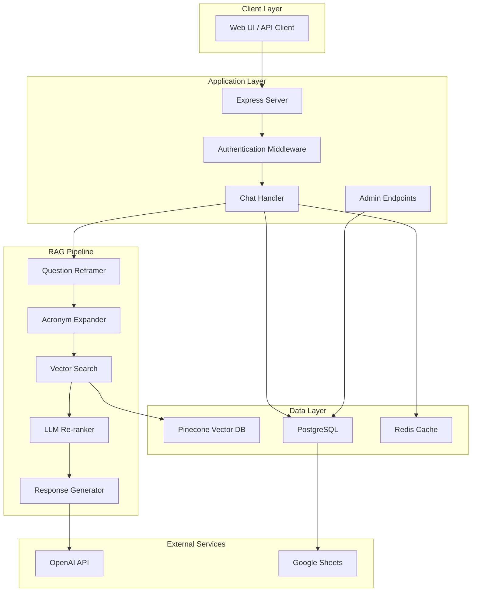

# Developer's Guide
**CAES Intranet Help Bot - Comprehensive Developer Documentation**

Welcome to the CAES Intranet Help Bot development guide! This document serves as the central hub for all developer documentation and will help you understand, develop, and deploy this RAG-powered chatbot system.

## 📋 Table of Contents

- [Quick Start](#quick-start)
- [What is This Project?](#what-is-this-project)
- [Technology Stack](#technology-stack)
- [Architecture Overview](#architecture-overview)
- [Documentation Map](#documentation-map)
- [Development Workflow](#development-workflow)
- [Common Tasks](#common-tasks)
- [Getting Help](#getting-help)

---

## Quick Start

**Want to get running in 5 minutes?** → [Quick Start Guide](guides/QUICK_START.md)

**New to the codebase?** → [Code Organization](architecture/CODE_ORGANIZATION.md)

**Need to use the API?** → [API Reference](guides/API_REFERENCE.md)

---

## What is This Project?

The CAES Intranet Help Bot is an AI-powered question-answering system that helps UGA CAES employees find information about internal resources, particularly Georgia Counts (GaCounts) documentation and procedures.

### Key Features

- **RAG (Retrieval-Augmented Generation)**: Combines vector search with GPT models for accurate, source-cited responses
- **Multi-Source Document Processing**: Ingests content from Dropbox, WordPress, intranet sites, and more
- **Smart Caching**: Two-tier caching (Redis + PostgreSQL) for instant responses
- **Conversation Memory**: Maintains context across multi-turn conversations
- **Feedback Learning**: Learns from user feedback to improve over time
- **LLM Re-ranking**: Intelligently reorders search results when similarity scores are uncertain
- **Admin Dashboard**: Analytics, cache management, and system monitoring

### Use Cases

1. **GaCounts Help**: "How do I report a presentation in GaCounts?"
2. **Policy Questions**: "What's the travel reimbursement policy?"
3. **Procedure Lookups**: "How do I submit a logo request?"
4. **System Information**: "Where can I find the latest brand guidelines?"

---

## Technology Stack

### Backend (Node.js)
- **Runtime**: Node.js 20.16+ with ES Modules
- **Framework**: Express.js for REST API
- **Language**: JavaScript (ES6+)

### AI & Vector Search
- **LLM Provider**: OpenAI (GPT-4o, GPT-5 support)
- **Embeddings**: OpenAI `text-embedding-3-large` (3072 dimensions)
- **Vector Database**: Pinecone (serverless, AWS us-east-1)
- **RAG Framework**: Custom implementation

### Data Storage
- **Primary Database**: PostgreSQL (conversations, cache, feedback)
- **Cache Layer**: Redis (optional, for performance)
- **Backup Storage**: Google Sheets API (feedback backup)

### Document Processing
- **Python 3.8+**: Advanced document extraction
- **Libraries**:
  - `pdf-parse`, `pdfjs-dist` (PDF processing)
  - `mammoth` (Word documents)
  - `xlsx` (Excel spreadsheets)
  - `python-pptx` (PowerPoint - Python)
  - `jsdom`, `turndown` (HTML to Markdown)

### Authentication & Security
- **Session-Based Auth**: Cookie-based sessions with PostgreSQL storage
- **API Key Auth**: For programmatic access
- **bcrypt**: Password hashing

### Deployment
- **Hosting**: Sevalla (Node.js hosting platform)
- **CI/CD**: GitHub Actions (optional)
- **Monitoring**: Built-in performance metrics

---

## Architecture Overview

### High-Level System Architecture



For detailed architecture, see [System Overview](architecture/SYSTEM_OVERVIEW.md).

### Request Flow

1. **User sends question** → Express server receives request
2. **Authentication** → Verify session or API key
3. **Cache Check** → Look for cached response (Redis/PostgreSQL)
4. **Query Processing** → Reframe question, expand acronyms
5. **Vector Search** → Query Pinecone for relevant document chunks
6. **Re-ranking** → Optionally reorder results with LLM
7. **Context Building** → Assemble context from top matches
8. **Response Generation** → Generate answer with OpenAI
9. **Post-Processing** → Format markdown, clean HTML
10. **Caching** → Store response for future use
11. **Memory Storage** → Save conversation turn to PostgreSQL

For detailed RAG pipeline, see [RAG Pipeline](architecture/RAG_PIPELINE.md).

---

## Documentation Map

### 🚀 Getting Started
| Document | Purpose | When to Read |
|----------|---------|--------------|
| [Quick Start](guides/QUICK_START.md) | Set up development environment in 5 minutes | First time setup |
| [Code Organization](architecture/CODE_ORGANIZATION.md) | Understand where everything lives | Day 1 orientation |
| [Development Workflow](guides/DEVELOPMENT_WORKFLOW.md) | Daily development practices | Starting development |

### 🏗️ Architecture & Design
| Document | Purpose | When to Read |
|----------|---------|--------------|
| [System Overview](architecture/SYSTEM_OVERVIEW.md) | High-level system architecture with diagrams | Understanding the big picture |
| [RAG Pipeline](architecture/RAG_PIPELINE.md) | How retrieval and generation works | Working on RAG features |
| [Database Schema](architecture/DATABASE_SCHEMA.md) | PostgreSQL tables and relationships | Database queries/migrations |
| [Document Ingestion Pipeline](architecture/DOCUMENT_INGESTION_PIPELINE.md) | How documents are processed and indexed | Adding new document sources |
| [Caching Architecture](architecture/CACHING_ARCHITECTURE.md) | Two-tier caching strategy | Performance optimization |
| [Conversation Memory](architecture/CONVERSATION_MEMORY.md) | Multi-turn conversation handling | Context features |
| [LLM Re-ranking](architecture/LLM_RERANKING.md) | Smart result reordering | Search quality |
| [Metadata Filtering](architecture/METADATA_FILTERING.md) | Content-aware search filtering | Search features |
| [Acronym Expansion](architecture/ACRONYM_EXPANSION.md) | Automatic acronym detection | Query preprocessing |

### 📖 Guides & Tutorials
| Document | Purpose | When to Read |
|----------|---------|--------------|
| [API Reference](guides/API_REFERENCE.md) | Complete API documentation with examples | Using the API |
| [Code Recipes](guides/CODE_RECIPES.md) | Common code patterns and examples | Implementing features |
| [Troubleshooting](guides/TROUBLESHOOTING.md) | Common issues and solutions | When things break |
| [Contributing](guides/CONTRIBUTING.md) | How to contribute code | Before first PR |
| [Testing Guide](guides/TESTING_GUIDE.md) | Testing strategies and procedures | Writing tests |
| [Command Reference](guides/COMMAND_REFERENCE.md) | All npm scripts and commands | Daily operations |
| [Caching Guide](guides/CACHING_GUIDE.md) | Cache management | Managing cache |

### 🔧 Setup & Deployment
| Document | Purpose | When to Read |
|----------|---------|--------------|
| [Deployment](setup/DEPLOYMENT.md) | Production deployment guide | Going to production |
| [Authentication Setup](setup/AUTH_IMPLEMENTATION.md) | Authentication system setup | Setting up auth |
| [Intranet Setup](setup/INTRANET_SETUP.md) | Intranet integration | Connecting to intranet |
| [Google Sheets Setup](setup/GOOGLE_SHEETS_SETUP.md) | Google Sheets integration | Setting up feedback backup |

### 🛠️ Advanced Topics
| Document | Purpose | When to Read |
|----------|---------|--------------|
| [Adding New Features](architecture/ADDING_NEW_FEATURES.md) | How to extend the system | Building new features |
| [Performance Optimizations](optimization/PERFORMANCE_OPTIMIZATIONS_SUMMARY.md) | Performance improvements | Optimizing performance |
| [GPT-5 Optimization](optimization/GPT5_OPTIMIZATION.md) | Using GPT-5 models | Model upgrades |
| [Testing Strategy](testing/TESTING_STRATEGY.md) | Testing phases and procedures | Test planning |

### 💼 Business & Planning
| Document | Purpose | When to Read |
|----------|---------|--------------|
| [OpenAI Justification](justifications/OpenAI_API_Justification.md) | OpenAI API business case | Budget discussions |
| [Pinecone Justification](justifications/Pinecone_Subscription_Justification.md) | Pinecone subscription business case | Budget discussions |
| [Priority Rankings](justifications/PRIORITY_RANKINGS.md) | Feature prioritization | Planning work |

---

## Development Workflow

### Daily Development

```bash
# 1. Pull latest changes
git pull origin main

# 2. Install dependencies (if needed)
npm install

# 3. Start development server
npm run dev

# 4. Make changes and test
# Server auto-reloads on file changes

# 5. Run tests (if available)
npm test

# 6. Commit and push
git add .
git commit -m "Description of changes"
git push origin your-branch
```

For detailed workflow, see [Development Workflow](guides/DEVELOPMENT_WORKFLOW.md).

### Common Development Tasks

**Add a new document source:**
```bash
# 1. Create a crawler in src/rag/crawlers/
# 2. Add npm script to package.json
# 3. Run crawler: npm run crawl:newsource
# 4. Ingest documents: npm run ingest:newsource
```

**Modify RAG pipeline:**
- Edit `src/rag/vector-ops/retrieve.js` for retrieval logic
- Edit `src/server.js` for response generation
- See [RAG Pipeline](architecture/RAG_PIPELINE.md)

**Add new API endpoint:**
- Add route handler in `src/server.js`
- Add authentication middleware if needed
- Document in [API Reference](guides/API_REFERENCE.md)

**Clear cache:**
```bash
# Clear all cache
curl -X POST http://localhost:3000/admin/cache/clear \
  -H "x-api-key: your-key" \
  -H "Content-Type: application/json" \
  -d '{"clearAll": true}'
```

For more examples, see [Code Recipes](guides/CODE_RECIPES.md).

---

## Common Tasks

### Running the Application

```bash
# Development mode
npm run dev

# Production mode
npm start

# With tunneling (for external access)
npm run dev:all
```

### Document Processing

```bash
# Crawl intranet sites
npm run crawl:olod
npm run crawl:oit
npm run crawl:brand

# Process Dropbox documents
npm run process:all-georgia-counts

# Ingest into Pinecone
npm run ingest:dropbox
npm run ingest:olod
```

### Cache Management

```bash
# Check cache stats
curl http://localhost:3000/admin/cache/stats -H "x-api-key: your-key"

# Clear all cache
curl -X POST http://localhost:3000/admin/cache/clear \
  -H "x-api-key: your-key" \
  -d '{"clearAll": true}'
```

### Database Migrations

```bash
# Run authentication migration
npm run migrate:auth
```

### Testing

```bash
# Test chat endpoint
curl -X POST http://localhost:3000/chat \
  -H "Content-Type: application/json" \
  -H "x-api-key: your-key" \
  -d '{"message": "How do I report in GaCounts?"}'
```

For complete command reference, see [Command Reference](guides/COMMAND_REFERENCE.md).

---

## Getting Help

### When You're Stuck

1. **Check [Troubleshooting Guide](guides/TROUBLESHOOTING.md)** - Common issues and solutions
2. **Search existing documentation** - Use Ctrl+F in this guide
3. **Check code comments** - Key files have inline documentation
4. **Review Git history** - `git log` for context on changes
5. **Ask the team** - Contact project maintainers

### Key Files to Understand

**Core Application:**
- `src/server.js:1` - Main Express server, all endpoints
- `src/rag/vector-ops/retrieve.js:228` - RAG retrieval logic
- `src/rag/ingestion/ingest.js:1` - Document ingestion

**Storage:**
- `src/storage/conversationMemoryPostgres.js:1` - Conversation storage
- `src/rag/cache/responseCache.js:1` - Response caching

**Authentication:**
- `src/middleware/sessionAuthMiddleware.js:1` - Session auth
- `src/auth/authRoutes.js:1` - Auth endpoints

**Document Processing:**
- `python/document_processor.py` - Python document extraction
- `src/rag/crawlers/` - Web crawlers

### Useful Commands

```bash
# View logs
tail -f logs/app.log

# Check environment variables
node -e "require('dotenv').config(); console.log(process.env)"

# Test database connection
psql $DATABASE_URL

# Test Redis connection
redis-cli -u $REDIS_URL ping
```

---

## Project Status & Roadmap

### Current Version: 1.0.0

**✅ Implemented:**
- RAG pipeline with Pinecone + OpenAI
- Session-based authentication
- Two-tier caching (Redis + PostgreSQL)
- Conversation memory
- Feedback learning system
- LLM re-ranking
- Admin dashboard
- Document processing pipeline
- Multiple document sources (Dropbox, WordPress, intranet)

**🚧 In Progress:**
- Enhanced testing suite
- Performance monitoring dashboard
- Automated document updates

**📋 Planned:**
- GraphQL API
- WebSocket streaming
- Multi-language support
- Advanced analytics
- A/B testing framework

---

## Contributing

We welcome contributions! Please read [Contributing Guide](guides/CONTRIBUTING.md) for:
- Code style guidelines
- Git workflow
- Pull request process
- Testing requirements

---

## Additional Resources

### External Documentation
- [OpenAI API Docs](https://platform.openai.com/docs)
- [Pinecone Documentation](https://docs.pinecone.io/)
- [PostgreSQL Documentation](https://www.postgresql.org/docs/)
- [Express.js Guide](https://expressjs.com/)

### Project Links
- **GitHub Repository**: [CAES-INTRANET-HELP-BOT](https://github.com/swa34/CAES-INTRANET-HELP-BOT)
- **Live Demo**: https://hospitalitychatbot-r7f2j.sevalla.app
- **Issue Tracker**: GitHub Issues

---

## Document Updates

This documentation is actively maintained. Last updated: October 2025

**Found an issue or have suggestions?** Open a GitHub issue or submit a pull request!

---

**Next Steps:**
1. Complete [Quick Start Guide](guides/QUICK_START.md) to set up your environment
2. Review [Code Organization](architecture/CODE_ORGANIZATION.md) to understand the structure
3. Read [API Reference](guides/API_REFERENCE.md) to understand the endpoints
4. Check [Development Workflow](guides/DEVELOPMENT_WORKFLOW.md) for daily development practices

Happy coding! 🚀
