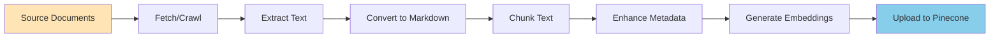

# Document Ingestion Pipeline
**How documents are processed and indexed for search**

This document explains the complete document ingestion pipeline from source to vector database.

## Table of Contents

- [Overview](#overview)
- [Pipeline Stages](#pipeline-stages)
- [Document Sources](#document-sources)
- [Processing Tools](#processing-tools)
- [Chunking Strategy](#chunking-strategy)
- [Metadata Enhancement](#metadata-enhancement)
- [Troubleshooting](#troubleshooting)

---

## Overview

The ingestion pipeline transforms documents from various sources into searchable vector embeddings.



---

## Pipeline Stages

### Stage 1: Fetch/Crawl
**Purpose**: Retrieve documents from sources

**Tools**:
- `src/rag/crawlers/*.js` - Web crawlers
- `python/dropbox_api_processor.py` - Dropbox API
- Manual uploads

**Output**: Raw documents (HTML, PDF, DOCX, etc.)

---

### Stage 2: Extract Text
**Purpose**: Convert documents to plain text

**Node.js Libraries**:
- `pdf-parse` - PDF extraction
- `mammoth` - Word documents
- `xlsx` - Excel spreadsheets
- `jsdom` - HTML parsing

**Python Libraries** (better extraction):
- `PyPDF2`, `pdfminer` - PDFs
- `python-docx` - Word documents
- `python-pptx` - PowerPoint
- `beautifulsoup4` - HTML

**Output**: Plain text

---

### Stage 3: Convert to Markdown
**Purpose**: Standardize format

**Tools**:
- `turndown` - HTML to Markdown
- Manual formatting for other types

**Format**:
```markdown
---
url: https://source-url.com
title: Document Title
category: ga_counts_app
---

Document content here...
```

**Output**: `.md` files in `docs/` directory

---

### Stage 4: Chunk Text
**File**: `src/rag/ingestion/chunk.js`

**Purpose**: Split documents into searchable chunks

**Strategy**:
```javascript
function chunkText(text, maxChars = 1200, overlap = 200) {
  const chunks = [];
  let start = 0;

  while (start < text.length) {
    const end = Math.min(start + maxChars, text.length);
    chunks.push(text.substring(start, end));
    start += maxChars - overlap; // Overlap for context
  }

  return chunks;
}
```

**Parameters**:
- **Max chars**: 1200 characters (~300 words)
- **Overlap**: 200 characters (maintains context)

**Why these numbers?**
- 1200 chars ≈ 300 tokens
- Keeps context intact
- Fits in embedding model context
- Good balance of granularity vs. context

---

### Stage 5: Enhance Metadata
**File**: `src/rag/ingestion/ingest-enhanced.js`

**Purpose**: Add searchable metadata

**Metadata Fields**:
```javascript
{
  source: 'document.md',
  sourceFile: 'document.md',
  url: 'https://...',
  text: 'Actual chunk text...',
  chunkIndex: 0,
  totalChunks: 5,

  // Enhanced metadata
  category: 'ga_counts_app',
  priority: 9,
  sourceType: 'dropbox_document',
  sourceEnvironment: 'production',
  keywords: ['gacounts', 'reporting']
}
```

**Categories**:
- `ga_counts_app` - GaCounts documentation
- `abo_policies` - ABO policies
- `hr_financial_help` - HR/financial resources
- `ets_training` - Training materials
- `marketing` - Marketing resources
- `brand_guidelines` - Brand assets
- `leadership_dev` - Leadership programs

**Priority** (1-10):
- 10: Critical (homepage, main guides)
- 7-9: Important (help docs, policies)
- 4-6: Useful (supplementary info)
- 1-3: Reference (old versions, archives)

---

### Stage 6: Generate Embeddings
**File**: `src/rag/ingestion/ingest.js:209`

**Purpose**: Convert text to vector representation

```javascript
async function embedTexts(texts) {
  const res = await openai.embeddings.create({
    model: 'text-embedding-3-large',
    input: texts // Batch of up to 10 chunks
  });
  return res.data.map(d => d.embedding);
}
```

**Model**: `text-embedding-3-large`
- **Dimensions**: 3072
- **Context**: 8191 tokens
- **Cost**: $0.13 per 1M tokens

**Batch Processing**: Process 10 chunks at a time for efficiency

---

### Stage 7: Upload to Pinecone
**File**: `src/rag/ingestion/ingest.js:358`

```javascript
const vectors = embeddings.map((emb, idx) => ({
  id: makeChunkId(fileName, i + idx), // Stable ID
  values: emb, // 3072-dim vector
  metadata: enhancedMetadata
}));

await index.upsert(vectors, NAMESPACE);
```

**Output**: Searchable vectors in Pinecone

---

## Document Sources

### Dropbox Documents (GaCounts Help)

**Count**: 65 documents
**Type**: PDF, Word, Text
**Location**: `docs/dropbox/`

**Process**:
```bash
# 1. Fetch from Dropbox
npm run fetch:dropbox

# 2. Process with Python (better extraction)
npm run process:all-georgia-counts

# 3. Ingest into Pinecone
npm run ingest:dropbox
```

---

### Intranet Websites

**Sites**:
- OLOD (Office of Leadership & Organizational Development)
- OIT (Office of Instructional Technology)
- ABO (Administrative Business Office)
- OMC (Office of Marketing & Communications)
- Brand Guidelines

**Process**:
```bash
# 1. Crawl website
npm run crawl:olod

# 2. Ingest into Pinecone
npm run ingest:olod
```

---

### WordPress Uploads

**Count**: 500+ documents
**Type**: PDF, Word, PowerPoint, Excel

**Process**:
```bash
# 1. Process uploads with Python
npm run process:wordpress

# 2. Ingest into Pinecone
npm run ingest:wordpress
```

---

## Processing Tools

### Python Processor
**File**: `python/document_processor.py`

**Advantages**:
- Better PDF extraction
- Handles complex Office files
- More robust error handling

**Usage**:
```bash
cd python
python document_processor.py "path/to/document.pdf"
```

**Output**: Markdown file in same directory

---

### Node.js Ingestion
**File**: `src/rag/ingestion/ingest.js`

**Usage**:
```bash
# Ingest all markdown files from a source
npm run ingest:dropbox

# With flags
npm run ingest:dropbox -- --dry           # Don't upsert, just log
npm run ingest:dropbox -- --purge         # Clear namespace first
npm run ingest:dropbox -- --skip-pdf      # Skip PDFs
npm run ingest:dropbox -- --recreate-index # Recreate Pinecone index
```

---

## Chunking Strategy

### Why Chunking?

**Problem**: Documents are too long for:
- Embedding models (max 8191 tokens)
- LLM context windows
- Precise retrieval

**Solution**: Split into smaller, overlapping chunks

### Chunk Size Analysis

| Size | Pros | Cons |
|------|------|------|
| 500 chars | Very precise | Loses context |
| 1200 chars | Good balance | Standard |
| 2000 chars | More context | Less precise, higher cost |

**Chosen**: 1200 characters with 200 overlap

### Overlap Importance

```
Chunk 1: [...............................]
                              [...............................]  Chunk 2
                                            Overlap ensures continuity
```

---

## Metadata Enhancement

### Automatic Detection

```javascript
// Detect category from content
if (text.includes('GaCounts') || text.includes('Georgia Counts')) {
  metadata.category = 'ga_counts_app';
  metadata.priority = 9;
}

// Detect homepage
if (filePath.includes('index.md') || text.includes('Welcome to')) {
  metadata.isHomepage = true;
  metadata.priority = 10;
}

// Detect source type
if (url.includes('dropbox.com')) {
  metadata.sourceType = 'dropbox_document';
}
```

### Manual Metadata

Add in document frontmatter:
```markdown
---
url: https://...
title: Document Title
category: abo_policies
priority: 8
sourceEnvironment: production
---
```

---

## Troubleshooting

### Large Documents Fail

**Error**: "This model's maximum context length..."

**Solution**:
```javascript
// Reduce chunk size
const chunks = chunkText(text, 800, 150); // Smaller chunks
```

---

### Poor Search Results

**Problem**: Documents indexed but not found

**Solutions**:
1. **Lower similarity threshold**:
   ```env
   MIN_SIMILARITY=0.65
   ```

2. **Improve metadata**:
   - Add better categories
   - Increase priority
   - Add keywords

3. **Re-chunk with more overlap**:
   ```javascript
   const chunks = chunkText(text, 1200, 300); // More overlap
   ```

---

### Ingestion Stops Midway

**Causes**:
- OpenAI rate limit
- Out of memory
- Network issues

**Solutions**:
```bash
# Process smaller batches
npm run ingest:dropbox -- --source dropbox

# Increase memory
node --max-old-space-size=8192 src/rag/ingestion/ingest.js --source dropbox

# Add retry logic in code
```

---

## Performance Optimization

### Batch Processing

Process 10 chunks per embedding request:
```javascript
for (let i = 0; i < chunks.length; i += BATCH_SIZE) {
  const slice = chunks.slice(i, i + BATCH_SIZE);
  const embeddings = await embedTexts(slice); // Single API call
}
```

**Benefit**: 10x faster than one-by-one

---

### Parallel Ingestion

```bash
# Run multiple ingestion jobs in parallel
npm run ingest:dropbox & npm run ingest:olod & npm run ingest:oit
```

---

## Related Documentation

- [System Overview](SYSTEM_OVERVIEW.md)
- [RAG Pipeline](RAG_PIPELINE.md)
- [Adding New Features](ADDING_NEW_FEATURES.md)

---

**Last Updated**: October 2025
