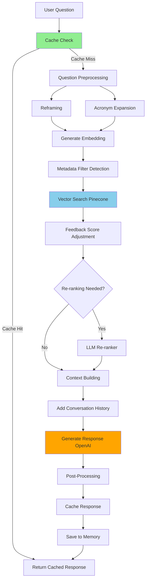

# RAG Pipeline
**Detailed explanation of the Retrieval-Augmented Generation pipeline**

This document explains how the chatbot retrieves relevant information and generates responses.

## Table of Contents

- [What is RAG?](#what-is-rag)
- [Pipeline Overview](#pipeline-overview)
- [Step-by-Step Process](#step-by-step-process)
- [Key Components](#key-components)
- [Configuration](#configuration)
- [Performance Optimization](#performance-optimization)

---

## What is RAG?

**Retrieval-Augmented Generation (RAG)** combines:
1. **Retrieval**: Finding relevant documents from a knowledge base
2. **Generation**: Using an LLM to generate answers based on retrieved documents

**Benefits**:
- ✅ Answers are grounded in real documents
- ✅ Cites sources for verification
- ✅ Can be updated without retraining
- ✅ Reduces hallucinations

---

## Pipeline Overview



---

## Step-by-Step Process

### Step 1: Cache Check
**File**: `src/rag/cache/responseCache.js`

```javascript
const cachedResult = await responseCache.get(userQuestion, sessionId);
if (cachedResult) {
  return cachedResult; // Instant response!
}
```

**Purpose**: Return instant responses for common questions

**Cache Layers**:
1. **Redis** (L1): Ultra-fast in-memory cache (~50ms)
2. **PostgreSQL** (L2): Persistent cache (~150ms)

**Cache Key**: Normalized question text (lowercase, no punctuation)

---

### Step 2: Question Preprocessing

#### 2a. Check for Follow-Up Questions
**File**: `src/analyzers/questionReframer.js:18`

```javascript
if (shouldReframeQuestion(message, conversationHistory)) {
  questionForRetrieval = await reframeQuestion(message, conversationHistory);
}
```

**Examples**:
- User: "What about collaborators?" → "How do I add collaborators in GaCounts?"
- User: "And the deadline?" → "What is the reporting deadline for GaCounts?"

#### 2b. Expand Acronyms
**File**: `src/rag/utils/acronymExpander.js`

```javascript
const expandedQuery = acronymExpander.expandQuery(userQuestion);
// "GaCounts" → "Georgia Counts (GaCounts)"
```

**Common Expansions**:
- GaCounts → Georgia Counts
- ABO → Administrative Business Office
- OLOD → Office of Leadership and Organizational Development
- OIT → Office of Instructional Technology

---

### Step 3: Generate Embedding
**File**: `src/rag/vector-ops/retrieve.js:352`

```javascript
const embedRes = await openai.embeddings.create({
  model: 'text-embedding-3-large',
  input: queryForEmbedding
});
const queryVector = embedRes.data[0].embedding; // 3072-dimensional vector
```

**Model**: `text-embedding-3-large`
- **Dimensions**: 3072
- **Cost**: $0.13 per 1M tokens (~$0.0002 per query)
- **Speed**: ~200ms

---

### Step 4: Metadata Filter Detection
**File**: `src/rag/vector-ops/retrieve.js:180`

Detects query intent and applies Pinecone filters:

```javascript
const filterDetection = detectMetadataFilters(userQuestion);
```

**Filter Examples**:

| Query Contains | Filter Applied | Effect |
|----------------|----------------|--------|
| "ga counts", "gacounts" | `category: {$in: ['documentation', 'ga_counts_app']}` | Only GaCounts docs |
| "policy", "policies" | `category: {$in: ['abo_policies']}, priority: {$gte: 7}` | High-priority policies |
| "logo", "brand" | `category: 'brand_guidelines'` | Brand content only |
| "training" | `category: {$in: ['ets_training', 'leadership_dev']}` | Training materials |
| None | `sourceEnvironment: 'production'` | Prefer production content |

---

### Step 5: Vector Search (Pinecone)
**File**: `src/rag/vector-ops/retrieve.js:392`

```javascript
const result = await ns.query({
  vector: queryVector,
  topK: 8,
  includeMetadata: true,
  filter: filter // Optional metadata filter
});
```

**Returns**: Top 8 most similar document chunks

**Similarity Metric**: Cosine similarity (0-1)
- **0.90+**: Excellent match
- **0.80-0.89**: Good match
- **0.75-0.79**: Acceptable match (threshold)
- **<0.75**: Below threshold, may not return answer

---

### Step 6: Feedback Score Adjustment
**File**: `src/rag/feedback/feedbackAnalyzer.js`

```javascript
const feedbackAdjustedMatches = await feedbackLearning.adjustRetrievalScores(
  matches,
  userQuestion
);
```

**Purpose**: Learn from user feedback to improve rankings

**Adjustment Logic**:
- **Positive feedback**: Boost score by up to +0.10
- **Negative feedback**: Lower score by up to -0.15
- **Pattern matching**: Boost if query matches past successful queries

**Example**:
```
Original scores: [0.84, 0.86, 0.82]
After adjustment: [0.94, 0.86, 0.82]
(First doc boosted due to positive feedback)
```

---

### Step 7: LLM Re-ranking (Conditional)
**File**: `src/rag/vector-ops/retrieve.js:36`

**Triggered when**:
- Top 3 scores are within 0.05 of each other
- Query contains temporal keywords ("latest", "current")
- Query is a comparison ("difference between", "versus")

```javascript
const rerankCheck = shouldTriggerReranking(userQuestion, feedbackAdjustedMatches);
if (rerankCheck.should) {
  finalMatches = await llmRerank(feedbackAdjustedMatches, userQuestion);
}
```

**Re-ranking Process**:
1. Send top results + question to GPT-4o-mini
2. Ask LLM to rank by relevance
3. Reorder results based on LLM ranking

**Cost**: ~$0.0001 per re-rank
**Latency**: +200ms

---

### Step 8: Date Prioritization
**File**: `src/rag/vector-ops/retrieve.js:397`

If scores are similar (within 0.02), prioritize more recent content:

```javascript
matches.sort((a, b) => {
  const scoreA = a.adjustedScore || a.score;
  const scoreB = b.adjustedScore || b.score;

  if (Math.abs(scoreA - scoreB) < 0.02) {
    return b.dateValue - a.dateValue; // Newer first
  }
  return scoreB - scoreA; // Higher score first
});
```

**Date Extraction**: From filename patterns like "2024_policy.md", "report-2025.pdf"

---

### Step 9: Context Building
**File**: `src/server.js:475`

Assemble relevant chunks into context:

```javascript
const contextText = matches
  .map(m => {
    const sourceUrl = m.metadata?.url;
    const textContent = m.metadata?.text;
    return `Source: ${sourceUrl}\n${textContent}`;
  })
  .join('\n\n---\n\n');
```

**Max Context**: ~6000 tokens (8 chunks × 750 tokens)

---

### Step 10: Add Conversation History
**File**: `src/server.js:546`

```javascript
const formattedHistory = await conversationMemory.formatHistoryForContext(sessionId);
const historySection = formattedHistory
  ? `\n\nCONVERSATION HISTORY:\n${formattedHistory}\n\nUse this history to provide context-aware responses.`
  : '';
```

**Format**:
```
User: How do I report in GaCounts?
Assistant: To report in GaCounts...

User: What about collaborators?
```

---

### Step 11: Response Generation
**File**: `src/server.js:590`

```javascript
const response = await openai.chat.completions.create({
  model: 'gpt-4o',
  messages: [
    { role: 'system', content: enhancedSystemPrompt },
    { role: 'user', content: message }
  ],
  temperature: 0.7
});

const answer = response.choices[0].message.content;
```

**Model**: GPT-4o or GPT-5
**Temperature**: 0.7 (balanced creativity/accuracy)
**Cost**: ~$0.005 per response

---

### Step 12: Post-Processing
**File**: `src/server.js:632`

Clean up response:
1. Convert any HTML to Markdown
2. Clean escaped entities
3. Remove unwanted tags
4. Ensure proper formatting

---

### Step 13: Caching
**File**: `src/server.js:808`

```javascript
if (topScore >= 0.75) {
  const cacheCheck = await qc.shouldCache(message, topScore);

  if (cacheCheck.shouldCache) {
    await responseCache.set(message, answer, sources, {
      confidence: topScore,
      ttlDays: 30
    });
  }
}
```

**Cache Criteria**:
- ✅ Top score ≥ 0.75
- ✅ No recent negative feedback
- ✅ Quality control passed

---

### Step 14: Save to Memory
**File**: `src/server.js:652`

```javascript
await conversationMemory.addTurn(
  sessionId,
  message,
  answer,
  sources,
  responseTime
);
```

Stores in PostgreSQL for conversation context.

---

## Key Components

### 1. Pinecone Client
**File**: `src/rag/utils/pineconeClient.js`

```javascript
export async function getPineconeIndex() {
  const pinecone = new Pinecone({
    apiKey: process.env.PINECONE_API_KEY
  });
  return pinecone.index(process.env.PINECONE_INDEX_NAME);
}
```

### 2. Feedback Analyzer
**File**: `src/rag/feedback/feedbackAnalyzer.js`

Learns from feedback to improve future responses.

### 3. Response Cache
**File**: `src/rag/cache/responseCache.js`

Two-tier caching for instant responses.

---

## Configuration

### Environment Variables

```env
# Embedding model
EMBED_MODEL=text-embedding-3-large

# Generation model
GEN_MODEL=gpt-4o

# Re-ranking model
RERANK_MODEL=gpt-4o-mini

# Similarity threshold
MIN_SIMILARITY=0.75

# Enable features
ENABLE_LLM_RERANKING=true
ENABLE_RESPONSE_CACHE=true

# Re-ranking trigger
RERANK_SCORE_THRESHOLD=0.05
```

---

## Performance Optimization

### Typical Response Breakdown

| Step | Time | Percentage |
|------|------|------------|
| Cache check | 50ms | 3% |
| Embedding | 200ms | 13% |
| Pinecone query | 150ms | 10% |
| Feedback adjustment | 50ms | 3% |
| Re-ranking (if needed) | 200ms | 13% |
| Response generation | 850ms | 56% |
| Post-processing | 30ms | 2% |
| **Total** | **~1530ms** | **100%** |

### Optimization Strategies

1. **Caching**: 40% hit rate → 60% faster responses
2. **Parallel requests**: Embed while checking cache
3. **Streaming**: First token in <500ms
4. **Selective re-ranking**: Only when needed
5. **Redis**: Reduces cache latency by 70%

---

## Related Documentation

- [System Overview](SYSTEM_OVERVIEW.md)
- [Caching Architecture](CACHING_ARCHITECTURE.md)
- [Feedback Learning](FEEDBACK_LEARNING_POSTGRES.md)
- [LLM Re-ranking](LLM_RERANKING.md)

---

**Last Updated**: October 2025
