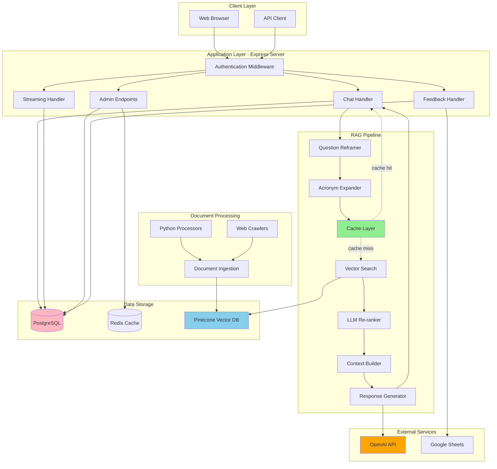
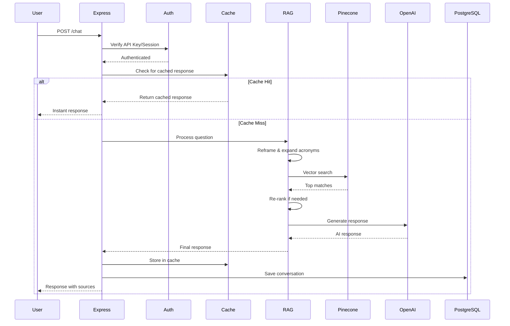
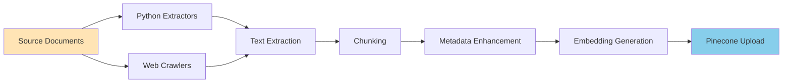

# System Overview
**High-level architecture and design of the CAES Intranet Help Bot**

This document provides a comprehensive overview of the system architecture, component interactions, and design decisions.

## Table of Contents

- [System Purpose](#system-purpose)
- [Architecture Diagram](#architecture-diagram)
- [Component Overview](#component-overview)
- [Data Flow](#data-flow)
- [Technology Stack](#technology-stack)
- [Design Decisions](#design-decisions)
- [Scalability](#scalability)

---

## System Purpose

The CAES Intranet Help Bot is a **Retrieval-Augmented Generation (RAG)** system that provides accurate, source-cited answers to questions about UGA CAES internal resources.

**Key Goals:**
- ✅ Provide instant answers to employee questions
- ✅ Cite reliable sources for all information
- ✅ Learn from user feedback to improve over time
- ✅ Maintain conversation context across multiple turns
- ✅ Deliver fast responses through intelligent caching

---

## Architecture Diagram

### High-Level System Architecture



### Request Flow Sequence



---

## Component Overview

### 1. Web UI (Frontend)
**Location**: `/public/`

**Purpose**: User interface for chat interaction

**Technologies**:
- HTML5, CSS3, Vanilla JavaScript
- Server-Sent Events (SSE) for streaming
- Cookie-based session management

**Key Features**:
- Real-time chat interface
- Source citations with clickable links
- Feedback submission
- Admin dashboard
- Login/authentication

---

### 2. Express Server
**Location**: `src/server.js:1`

**Purpose**: Main application server and API gateway

**Technologies**:
- Node.js 20.16+
- Express.js framework
- ES Modules

**Responsibilities**:
- Route HTTP requests
- Authenticate users
- Coordinate RAG pipeline
- Manage sessions
- Handle errors
- Serve static files

**Key Endpoints**:
- `POST /chat` - Main chat endpoint
- `POST /chat/stream` - Streaming responses
- `POST /feedback` - Feedback submission
- `GET /api/analytics` - Analytics data
- Admin endpoints for cache/conversation management

---

### 3. Authentication System
**Location**: `src/auth/`, `src/middleware/`

**Purpose**: User authentication and authorization

**Technologies**:
- Session-based authentication
- bcrypt for password hashing
- PostgreSQL for session storage
- Cookie-based sessions

**Security Features**:
- Secure password hashing (bcrypt)
- Session expiration
- API key validation
- Role-based access (user/developer)

---

### 4. RAG Pipeline (Core)
**Location**: `src/rag/`

**Purpose**: Retrieve relevant documents and generate answers

**Components**:

#### a) Question Reframer
**File**: `src/analyzers/questionReframer.js`
- Detects follow-up questions
- Rewrites questions with context
- Generates clarification requests

#### b) Acronym Expander
**File**: `src/rag/utils/acronymExpander.js`
- Expands common acronyms (GaCounts → Georgia Counts)
- Improves search recall

#### c) Cache Layer
**File**: `src/rag/cache/responseCache.js`
- Two-tier caching (Redis + PostgreSQL)
- Instant responses for common questions
- Quality control for cached entries

#### d) Vector Search
**File**: `src/rag/vector-ops/retrieve.js:228`
- Query Pinecone vector database
- Metadata filtering
- Date prioritization
- Feedback-based score adjustment

#### e) LLM Re-ranker
**File**: `src/rag/vector-ops/retrieve.js:36`
- Re-orders results when scores are uncertain
- Uses GPT-4o-mini for fast, cheap reranking
- Triggered when top 3 scores are within 0.05

#### f) Context Builder
**File**: `src/server.js:475`
- Assembles relevant document chunks
- Formats for LLM input
- Adds conversation history

#### g) Response Generator
**File**: `src/server.js:590`
- Calls OpenAI API (GPT-4o or GPT-5)
- Supports streaming responses
- Ensures markdown formatting

---

### 5. Document Processing
**Location**: `python/`, `src/rag/crawlers/`, `src/rag/ingestion/`

**Purpose**: Extract text from documents and ingest into vector database

**Pipeline**:



**Document Sources**:
- Dropbox (GaCounts help docs)
- WordPress uploads
- Intranet websites (OLOD, OIT, ABO, OMC)
- Brand guidelines
- Policy documents

**Processing Steps**:
1. **Fetch**: Download or crawl documents
2. **Extract**: Convert PDFs, Word, PPT to text (Python)
3. **Clean**: Remove navigation, headers, footers
4. **Chunk**: Split into 1200-character chunks with 200-char overlap
5. **Enhance**: Add metadata (source, category, priority)
6. **Embed**: Generate 3072-dimension vectors (OpenAI)
7. **Upsert**: Upload to Pinecone

---

### 6. Vector Database (Pinecone)
**Service**: Pinecone (Serverless, AWS us-east-1)

**Purpose**: Store and search document embeddings

**Configuration**:
- Index name: `uga-intranet-index`
- Dimensions: 3072 (text-embedding-3-large)
- Metric: Cosine similarity
- Namespace: `__default__`

**Metadata Stored**:
```json
{
  "source": "document_name.md",
  "sourceFile": "document_name.md",
  "url": "https://source-url.com",
  "text": "Actual document text...",
  "chunkIndex": 0,
  "totalChunks": 5,
  "category": "ga_counts_app",
  "priority": 9,
  "sourceType": "dropbox_document",
  "sourceEnvironment": "production"
}
```

**Search Process**:
1. Convert question to vector (3072-dim embedding)
2. Query Pinecone with metadata filters
3. Return top K most similar chunks (default: 8)
4. Apply feedback-based score adjustments
5. Optionally re-rank with LLM

---

### 7. PostgreSQL Database
**Service**: PostgreSQL (local or cloud)

**Purpose**: Store conversations, cache, user data, feedback

**Key Tables**:

#### `conversations`
Stores all chat interactions:
```sql
CREATE TABLE conversations (
  id SERIAL PRIMARY KEY,
  session_id TEXT NOT NULL,
  question TEXT NOT NULL,
  answer TEXT NOT NULL,
  sources JSONB,
  feedback_rating INTEGER,
  feedback_comment TEXT,
  comment_sentiment TEXT,
  comment_issues JSONB,
  response_time_ms INTEGER,
  timestamp TIMESTAMP DEFAULT CURRENT_TIMESTAMP
);
```

#### `cached_responses`
Stores cached responses:
```sql
CREATE TABLE cached_responses (
  id TEXT PRIMARY KEY,
  question TEXT NOT NULL,
  question_normalized TEXT NOT NULL,
  response TEXT NOT NULL,
  sources JSONB,
  confidence NUMERIC,
  hit_count INTEGER DEFAULT 0,
  positive_feedback INTEGER DEFAULT 0,
  negative_feedback INTEGER DEFAULT 0,
  is_active BOOLEAN DEFAULT TRUE,
  created_at TIMESTAMP DEFAULT CURRENT_TIMESTAMP,
  last_hit_at TIMESTAMP
);
```

#### `users`
Stores user accounts:
```sql
CREATE TABLE users (
  id SERIAL PRIMARY KEY,
  username TEXT UNIQUE NOT NULL,
  email TEXT UNIQUE NOT NULL,
  password_hash TEXT NOT NULL,
  role TEXT DEFAULT 'user',
  is_developer BOOLEAN DEFAULT FALSE,
  created_at TIMESTAMP DEFAULT CURRENT_TIMESTAMP
);
```

See [Database Schema](DATABASE_SCHEMA.md) for complete schema.

---

### 8. Redis Cache (Optional)
**Service**: Redis (local or cloud)

**Purpose**: High-speed caching for performance

**Cached Data**:
- Vector query results (10-minute TTL)
- Popular questions tracking
- Session data (if using Redis sessions)

**Benefits**:
- 10-100x faster than PostgreSQL for cache hits
- Reduces Pinecone API calls
- Lowers OpenAI costs

---

### 9. OpenAI API
**Service**: OpenAI Platform

**Purpose**: Generate embeddings and responses

**Models Used**:

| Model | Purpose | Cost | Speed |
|-------|---------|------|-------|
| `text-embedding-3-large` | Document embeddings | $0.13/1M tokens | Fast |
| `gpt-4o` | Main chat responses | $2.50/1M in | Medium |
| `gpt-5` | Advanced reasoning (optional) | $5/1M in | Slow |
| `gpt-4o-mini` | Re-ranking, analysis | $0.15/1M in | Very fast |

**API Endpoints**:
- `/v1/embeddings` - Generate embeddings
- `/v1/chat/completions` - Chat completions (GPT-4o)
- `/v1/responses` - Responses API (GPT-5)

---

### 10. Feedback System
**Location**: `src/rag/feedback/`, `src/storage/`

**Purpose**: Collect and learn from user feedback

**Features**:
- Thumbs up/down ratings
- Comment collection
- Sentiment analysis (LLM-powered)
- Issue detection (outdated info, missing context, etc.)
- Source performance tracking

**Storage**:
- Primary: PostgreSQL
- Backup: Google Sheets

**Learning Mechanism**:
- Boost scores for positively-rated sources
- Lower scores for negatively-rated sources
- Pattern matching for common user intents
- Cache quality control

---

## Data Flow

### Complete Request Flow

```
1. User sends question
   ↓
2. Express server receives request
   ↓
3. Authentication middleware validates API key/session
   ↓
4. Check cache (Redis → PostgreSQL)
   ├─ Cache hit → Return instant response (150ms avg)
   └─ Cache miss → Continue to RAG pipeline
        ↓
5. Question preprocessing
   ├─ Check for follow-up (reframe if needed)
   ├─ Expand acronyms
   └─ Detect clarification needs
        ↓
6. Embedding generation (OpenAI)
   ↓
7. Vector search (Pinecone)
   ├─ Apply metadata filters
   ├─ Query with embedding
   └─ Return top 8 matches
        ↓
8. Score adjustment (feedback learning)
   ↓
9. Re-ranking (if needed)
   ├─ Check if scores are uncertain
   ├─ Use GPT-4o-mini to reorder
   └─ Return reordered matches
        ↓
10. Context building
    ├─ Assemble document chunks
    ├─ Add conversation history
    └─ Format for LLM
        ↓
11. Response generation (OpenAI)
    ├─ Stream tokens in real-time (optional)
    └─ Post-process (clean HTML, format markdown)
        ↓
12. Save results
    ├─ Cache response (if confidence ≥ 0.75)
    ├─ Save to conversation memory (PostgreSQL)
    └─ Track performance metrics
        ↓
13. Return response to user (1.5s avg)
```

### Document Ingestion Flow

```
1. Source documents (PDFs, DOCX, web pages)
   ↓
2. Document fetching/crawling
   ├─ Dropbox API (dropbox_api_processor.py)
   ├─ Web crawlers (crawl*.js)
   └─ Manual uploads
        ↓
3. Text extraction (Python processors)
   ├─ PDF → text (PyPDF2, pdfminer)
   ├─ DOCX → text (python-docx)
   ├─ PPTX → text (python-pptx)
   └─ HTML → markdown (beautifulsoup4, html2text)
        ↓
4. Save as markdown (.md files)
   ↓
5. Ingestion pipeline (ingest.js)
   ├─ Read markdown files
   ├─ Chunk text (1200 chars, 200 overlap)
   ├─ Enhance metadata
   ├─ Generate embeddings (OpenAI)
   └─ Batch upsert to Pinecone (10 chunks/batch)
        ↓
6. Documents searchable in vector DB
```

---

## Technology Stack

### Backend Stack
```
Node.js 20.16
  └── Express.js (Web server)
       ├── OpenAI SDK (AI/embeddings)
       ├── @pinecone-database/pinecone (Vector DB)
       ├── pg (PostgreSQL client)
       ├── ioredis (Redis client)
       └── bcrypt (Password hashing)
```

### Document Processing Stack
```
Python 3.8+
  ├── PyPDF2 (PDF processing)
  ├── python-docx (Word documents)
  ├── python-pptx (PowerPoint)
  ├── beautifulsoup4 (HTML parsing)
  ├── requests (HTTP client)
  └── html2text (HTML to Markdown)
```

### Data Stack
```
PostgreSQL (Primary database)
Redis (Cache layer - optional)
Pinecone (Vector database)
Google Sheets (Backup storage)
```

### Frontend Stack
```
Vanilla JavaScript (No framework)
HTML5
CSS3
Server-Sent Events (Streaming)
```

---

## Design Decisions

### Why RAG Instead of Fine-Tuning?

**Reasons for RAG**:
- ✅ **Up-to-date**: Documents can be updated instantly
- ✅ **Explainable**: Cites sources for every answer
- ✅ **Cost-effective**: No expensive fine-tuning
- ✅ **Flexible**: Easy to add new document sources
- ✅ **Hallucination reduction**: Grounded in real documents

**RAG Limitations**:
- ❌ Requires good document coverage
- ❌ Dependent on search quality
- ❌ Slightly slower than pure LLM

### Why Pinecone Instead of PostgreSQL pgvector?

**Reasons for Pinecone**:
- ✅ **Performance**: Sub-100ms queries at scale
- ✅ **Serverless**: No infrastructure management
- ✅ **Scalability**: Auto-scales to billions of vectors
- ✅ **Reliability**: 99.9% uptime SLA

**Pinecone Limitations**:
- ❌ Cost increases with scale
- ❌ Vendor lock-in
- ❌ Less control over infrastructure

### Why Two-Tier Caching (Redis + PostgreSQL)?

**Architecture**:
```
Request → Check Redis → Check PostgreSQL → RAG Pipeline
          (L1 cache)    (L2 cache)
```

**Benefits**:
- ✅ **Speed**: Redis serves in <50ms
- ✅ **Persistence**: PostgreSQL survives restarts
- ✅ **Flexibility**: Redis optional, PostgreSQL required
- ✅ **Analytics**: PostgreSQL enables rich queries

### Why LLM Re-ranking?

**Problem**: Vector search sometimes ranks docs incorrectly when scores are very close (e.g., 0.86, 0.84, 0.83).

**Solution**: Use a fast LLM (GPT-4o-mini) to re-order results based on semantic relevance.

**Trigger**: Only when top 3 scores are within 0.05 of each other.

**Cost**: ~$0.0001 per re-rank (very cheap)

**Performance**: +~200ms latency, but better accuracy

---

## Scalability

### Current Capacity

| Metric | Capacity | Notes |
|--------|----------|-------|
| Documents | 1,000+ | Currently stored |
| Vectors | 50,000+ | Pinecone chunks |
| Concurrent users | 100+ | Express can handle |
| Requests/second | 10-20 | Limited by OpenAI rate limits |
| Database connections | 20 | PostgreSQL pool |

### Scaling Strategies

#### Horizontal Scaling (Multiple Servers)
```
Load Balancer
  ├── Express Server 1
  ├── Express Server 2
  └── Express Server 3
       ↓
  Shared PostgreSQL
  Shared Redis
  Shared Pinecone
```

#### Vertical Scaling (Bigger Server)
- Increase Node.js memory: `--max-old-space-size=8192`
- Increase PostgreSQL connections
- Increase Redis memory

#### Caching Strategy
- Increase cache TTL for stable content
- Pre-cache popular questions
- Use CDN for static assets

#### Database Optimization
- Add indexes on frequently queried columns
- Partition large tables
- Use read replicas for analytics

---

## Performance Characteristics

### Response Times (Typical)

| Scenario | Time | Components |
|----------|------|------------|
| Cache hit (Redis) | 50-150ms | Redis lookup only |
| Cache hit (PostgreSQL) | 150-300ms | PostgreSQL query only |
| Full RAG (no rerank) | 1200-1800ms | Embedding (200ms) + Pinecone (150ms) + GPT-4o (850ms) |
| Full RAG (with rerank) | 1400-2200ms | + GPT-4o-mini rerank (200ms) |
| Streaming response | 200ms + streaming | First token fast, then stream |

### Cost Per Request (Estimates)

| Component | Cost | Notes |
|-----------|------|-------|
| Embedding | $0.0002 | text-embedding-3-large |
| Pinecone query | $0.0001 | Serverless pricing |
| GPT-4o response | $0.0050 | ~2K tokens |
| Re-ranking | $0.0001 | GPT-4o-mini |
| **Total** | **~$0.0054** | Per non-cached request |
| **Cached** | **~$0** | Near-zero cost |

**Cache value**: At 40% cache hit rate, saves ~$0.0022 per request.

---

## Security Considerations

### Authentication
- ✅ Bcrypt password hashing (10 rounds)
- ✅ Secure session cookies (httpOnly, secure)
- ✅ API key validation
- ✅ Role-based access control

### Data Protection
- ✅ No PII stored in vectors
- ✅ Conversation data encrypted at rest (PostgreSQL)
- ✅ HTTPS in production
- ✅ API keys in environment variables

### API Security
- ✅ API key required for all endpoints
- ✅ Session validation
- ✅ Input sanitization
- ✅ Rate limiting (planned)

---

## Monitoring & Observability

### Metrics Tracked

- Request count and rate
- Response times (breakdown by component)
- Cache hit rates
- Error rates
- Feedback ratings
- Token usage and costs

### Logging

- Request/response logging
- Error logging with stack traces
- Performance logging
- Feedback logging

### Alerting (Planned)

- High error rate
- Slow response times
- Cache hit rate drop
- Database connection issues

---

## Related Documentation

- [RAG Pipeline](RAG_PIPELINE.md) - Detailed RAG implementation
- [Database Schema](DATABASE_SCHEMA.md) - Complete database design
- [Code Organization](CODE_ORGANIZATION.md) - Where everything lives
- [Document Ingestion](DOCUMENT_INGESTION_PIPELINE.md) - How docs are processed

---

**Last Updated**: October 2025
