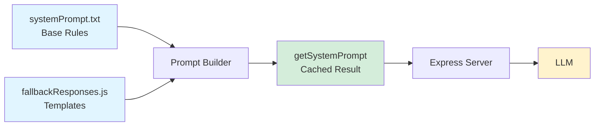

# System Prompt & Fallback Architecture

**Modular system prompt construction with centralized fallback responses**

This document describes the modular architecture for building the system prompt and managing fallback responses when the chatbot cannot find information in the knowledge base.

## Table of Contents

- [Overview](#overview)
- [Architecture](#architecture)
- [Key Components](#key-components)
- [Fallback Response System](#fallback-response-system)
- [URL-First Rule](#url-first-rule)
- [Adding New Fallbacks](#adding-new-fallbacks)
- [Testing & Validation](#testing--validation)
- [Hot Reload in Development](#hot-reload-in-development)

---

## Overview

The system prompt is the core instruction set that guides the LLM's behavior. Rather than maintaining it as a single large text file, we use a **modular architecture** that:

✅ **Centralizes URL management** - Single source of truth for all canonical URLs  
✅ **Enforces consistency** - Programmatically ensures URL-first rule compliance  
✅ **Enables validation** - Automated testing of fallback structure and content  
✅ **Scales gracefully** - Easy to add new fallbacks without duplicating code  
✅ **Type-safe** - Can use TypeScript for compile-time validation

---

## Architecture

### Component Diagram

```
┌─────────────────────────────────────────────────────────┐
│                     server.js                           │
│                                                         │
│  import { getSystemPrompt } from './prompts/index.js'  │
│  systemPrompt = getSystemPrompt()                      │
└────────────────────┬────────────────────────────────────┘
                     │
                     ▼
┌─────────────────────────────────────────────────────────┐
│              src/prompts/index.js                       │
│              (Prompt Builder)                           │
│                                                         │
│  • Loads base prompt from systemPrompt.txt             │
│  • Combines with modular fallbacks                     │
│  • Validates structure                                 │
│  • Caches result (production) or hot-reloads (dev)    │
└────────────────────┬────────────────────────────────────┘
                     │
                     ▼
┌─────────────────────────────────────────────────────────┐
│         src/config/fallbackResponses.js                 │
│         (Fallback Configuration)                        │
│                                                         │
│  • CANONICAL_URLS - Single source of truth             │
│  • CONTACTS - Reusable contact information             │
│  • FALLBACK_RESPONSES - Template generators            │
│  • CONTEXT_BLOCKS - Special instruction blocks         │
└─────────────────────────────────────────────────────────┘
```

### Data Flow



---

## Key Components

### 1. `src/config/fallbackResponses.js`

**Purpose:** Centralized configuration for all fallback responses and canonical URLs.

**Key Exports:**

- `CANONICAL_URLS` - Object containing all official resource URLs
- `CONTACTS` - Reusable contact information blocks
- `FALLBACK_RESPONSES` - Pre-built fallback template generators
- `CONTEXT_BLOCKS` - Special instruction blocks (IT vs OIT, Leave/PTO rules)
- `validateCanonicalUrls()` - Validates URL format and structure
- `getAllFallbackTemplates()` - Returns all generated templates for testing

**Example:**

```javascript
import {
  FALLBACK_RESPONSES,
  CANONICAL_URLS,
} from './config/fallbackResponses.js';

// Get technical support fallback
const techSupport = FALLBACK_RESPONSES.technical();
console.log(techSupport);
// Output: "For technical support, visit [CAES OIT](https://oit.caes.uga.edu/)..."

// Access canonical URL
console.log(CANONICAL_URLS.CAES_OIT); // "https://oit.caes.uga.edu/"
```

### 2. `src/prompts/index.js`

**Purpose:** Builds the complete system prompt by combining base rules with modular components.

**Key Exports:**

- `getSystemPrompt(forceReload)` - Returns complete system prompt (cached)
- `buildSystemPrompt()` - Generates fresh system prompt
- `validateSystemPrompt()` - Validates prompt structure and content
- `printValidationResults()` - Prints validation report to console
- `enableHotReload()` - Watches files and reloads on change (dev mode)

**Example:**

```javascript
import { getSystemPrompt, printValidationResults } from './prompts/index.js';

// Validate prompt structure
printValidationResults();

// Get cached system prompt
const prompt = getSystemPrompt();

// Force reload (useful after config changes)
const freshPrompt = getSystemPrompt(true);
```

### 3. `src/prompts/systemPrompt.txt`

**Purpose:** Contains core anti-hallucination rules, greeting/farewell responses, and base instructions.

**Structure:**

- Critical anti-hallucination rules
- Login question handling
- Greeting/farewell templates
- General instructions
- Policy/procedure guidelines
- Form and document handling
- Email question guidance

**Note:** Fallback responses are now generated by the modular system and injected at build time.

---

## Fallback Response System

### The buildFallbackTemplate Function

All fallback responses are built using a consistent template builder that enforces the URL-first pattern:

```javascript
function buildFallbackTemplate({
  primaryUrl, // Main resource URL (shown first)
  primaryLinkText, // Display text for primary link
  description, // Brief description
  additionalLinks, // Optional additional links array
  contactInfo, // Optional contact information
  additionalGuidance, // Optional extra guidance
}) {
  // URL always appears first in output
  let response = `${description} [${primaryLinkText}](${primaryUrl})`;

  // Additional sections follow
  // ...
}
```

### Available Fallback Types

| Fallback Type | When Used                     | Primary URL               |
| ------------- | ----------------------------- | ------------------------- |
| `general`     | Unknown topic or broad query  | CAES Intranet             |
| `department`  | Department-specific question  | CAES Departments          |
| `policy`      | Policy or procedure query     | ABO / UGA Policies        |
| `technical`   | Technical support needed      | CAES OIT                  |
| `it`          | IT help (alias for technical) | CAES OIT                  |
| `leave`       | Leave/PTO questions           | TeamDynamix Leave Article |

### Example Fallback Output

```javascript
FALLBACK_RESPONSES.technical();
```

**Generates:**

```
For technical support, visit [CAES OIT](https://oit.caes.uga.edu/)

You can also contact the CAES Office of Information Technology (OIT):
- Athens Campus: Email oithelp@uga.edu or call 706-542-2139
- Griffin Campus: Email grifoit@uga.edu or call 770-229-3020
```

**Notice:** URL appears first, then contact details. ✅

---

## URL-First Rule

### The Rule

**All fallback responses MUST show a clickable markdown URL before any explanatory text, contact information, or additional guidance.**

### Why This Matters

❌ **Bad (Contact info first):**

```
For technical support, contact OIT:
- Athens: oithelp@uga.edu or 706-542-2139
- Visit: https://oit.caes.uga.edu/
```

✅ **Good (URL first):**

```
For technical support, visit [CAES OIT](https://oit.caes.uga.edu/)

You can also contact:
- Athens: oithelp@uga.edu or 706-542-2139
```

### Enforcement

The modular architecture **programmatically enforces** this rule:

1. **Template builder** - `buildFallbackTemplate()` always outputs URL first
2. **Validation tests** - Automated tests verify URL appears before contact info
3. **Type safety** - Can use TypeScript to enforce structure at compile time

### Validation

Run tests to verify compliance:

```bash
node tests/test-fallback-responses.js
```

Tests check:

- ✅ URL appears in first sentence
- ✅ No contact info (email, phone) before URL
- ✅ All URLs use markdown format `[Text](URL)`
- ✅ All URLs reference canonical URL list

---

## Adding New Fallbacks

### Step 1: Add Canonical URL (if needed)

```javascript
// In src/config/fallbackResponses.js

export const CANONICAL_URLS = {
  // ... existing URLs

  // Add new canonical URL
  MY_NEW_RESOURCE: 'https://example.uga.edu/resource/',
};
```

### Step 2: Add Contact Info (if needed)

```javascript
export const CONTACTS = {
  // ... existing contacts

  MY_RESOURCE: {
    email: 'resource@uga.edu',
    phone: '706-542-XXXX',
  },
};
```

### Step 3: Create Fallback Template

```javascript
export const FALLBACK_RESPONSES = {
  // ... existing fallbacks

  myResource: () =>
    buildFallbackTemplate({
      primaryUrl: CANONICAL_URLS.MY_NEW_RESOURCE,
      primaryLinkText: 'My Resource',
      description: 'For questions about this resource, visit',
      contactInfo: `You can also contact:
- Email: ${CONTACTS.MY_RESOURCE.email}
- Phone: ${CONTACTS.MY_RESOURCE.phone}`,
      additionalGuidance: 'Additional helpful information here.',
    }),
};
```

### Step 4: Add to System Prompt

```javascript
// In src/prompts/index.js, update buildFallbackSection()

function buildFallbackSection() {
  return `If you cannot find the requested information...

For general queries:
"${FALLBACK_RESPONSES.general()}"

For my resource queries:
"${FALLBACK_RESPONSES.myResource()}"

...`;
}
```

### Step 5: Add Tests

```javascript
// In tests/test-fallback-responses.js

it('myResource fallback should show URL first', () => {
  const template = FALLBACK_RESPONSES.myResource();

  const urlIndex = template.indexOf('[My Resource]');
  const emailIndex = template.indexOf('@uga.edu');

  assert.ok(urlIndex < emailIndex, 'URL should appear before email');
});
```

### Step 6: Run Validation

```bash
# Run tests
node tests/test-fallback-responses.js

# Validate system prompt
node -e "import('./src/prompts/index.js').then(m => m.printValidationResults())"
```

---

## Testing & Validation

### Automated Tests

**Location:** `tests/test-fallback-responses.js`

**Test Coverage:**

- ✅ URL validation (all URLs use HTTPS and valid format)
- ✅ URL-first rule compliance (URL before contact info)
- ✅ Template consistency (markdown links, canonical URLs)
- ✅ System prompt integration (all sections present)
- ✅ Contact information formatting

**Run tests:**

```bash
node tests/test-fallback-responses.js
```

**Expected output:**

```
✔ should have valid canonical URLs
✔ should use HTTPS for all URLs
✔ general fallback should have URL in first sentence
✔ technical fallback should show CAES OIT link before contact details
...
ℹ tests 21
ℹ pass 21
ℹ fail 0
```

### Manual Validation

**Print validation report:**

```bash
node -e "import('./src/prompts/index.js').then(m => m.printValidationResults())"
```

**Output:**

```
📋 System Prompt Validation Results:

✓ INFO:
   - Found 42 markdown links in prompt
   - Validated 7 canonical URLs
   - System prompt size: 15.23 KB

✅ System prompt validation passed!
```

### Validate Specific Fallback

```javascript
import { FALLBACK_RESPONSES } from './src/config/fallbackResponses.js';

const technical = FALLBACK_RESPONSES.technical();
console.log(technical);

// Verify URL appears first
const firstLinkIndex = technical.indexOf('[CAES OIT]');
const firstEmailIndex = technical.indexOf('@uga.edu');
console.log('URL first:', firstLinkIndex < firstEmailIndex); // Should be true
```

---

## Hot Reload in Development

### How It Works

In development mode (`NODE_ENV=development`), the system automatically reloads the prompt when files change.

**Watched files:**

- `src/prompts/systemPrompt.txt`
- `src/config/fallbackResponses.js`

**Cache behavior:**

- **Production:** Prompt loaded once at startup, cached forever
- **Development:** TTL-based cache (5 minutes) + hot reload on file change

### Enable Hot Reload

```javascript
// In server.js (already configured)
import { getSystemPrompt, enableHotReload } from './prompts/index.js';

systemPrompt = getSystemPrompt();
enableHotReload(); // Watches files in dev mode
```

### Testing Hot Reload

1. Start server in development mode:

   ```bash
   set NODE_ENV=development
   npm start
   ```

2. Edit `src/config/fallbackResponses.js`

3. Watch console:

   ```
   📝 Fallback config changed: fallbackResponses.js, clearing cache...
   🔄 System prompt reloaded (development mode)
   ```

4. Next request will use updated prompt

---

## Performance

### Memory Usage

- **Text file approach:** ~10-20 KB
- **Modular approach:** ~20-30 KB (includes JavaScript objects)
- **Difference:** Negligible (~10 KB extra)

### Speed

| Operation               | Time                    |
| ----------------------- | ----------------------- |
| First load (production) | ~2-5ms                  |
| Cached retrieval        | ~0ms (string in memory) |
| Template generation     | ~0.01ms per template    |
| Hot reload (dev)        | ~5-10ms                 |

**Conclusion:** No meaningful performance difference from text file approach. The modular architecture is effectively zero-cost at runtime.

### Caching Strategy

```javascript
// Production: Load once, cache forever
if (NODE_ENV === 'production' && cachedPrompt) {
  return cachedPrompt;
}

// Development: TTL-based cache (5 minutes)
if (cachedPrompt && Date.now() - lastLoadTime < CACHE_TTL) {
  return cachedPrompt;
}

// Generate fresh prompt
cachedPrompt = buildSystemPrompt();
```

---

## Benefits of Modular Architecture

### 1. Single Source of Truth

❌ **Old approach:**

```text
Visit https://oit.caes.uga.edu/ (appears in 5 places)
```

_Risk: Typo in one place, inconsistency_

✅ **New approach:**

```javascript
CANONICAL_URLS.CAES_OIT; // Used everywhere
```

_Benefit: Change once, applied everywhere_

### 2. Enforced Consistency

❌ **Old approach:**

```text
Manually ensure URL appears first in each template
```

_Risk: Easy to forget, inconsistent ordering_

✅ **New approach:**

```javascript
buildFallbackTemplate({ primaryUrl, ... })
// URL ALWAYS first by design
```

_Benefit: Impossible to violate URL-first rule_

### 3. Automated Testing

❌ **Old approach:**

```text
Manually review text file for consistency
```

_Risk: Human error, time-consuming_

✅ **New approach:**

```bash
node tests/test-fallback-responses.js
```

_Benefit: Automated validation in CI/CD_

### 4. Type Safety (Optional)

With TypeScript:

```typescript
interface FallbackTemplate {
  primaryUrl: string;
  primaryLinkText: string;
  description: string;
  additionalLinks?: Array<{ text: string; url: string }>;
}

function buildFallbackTemplate(config: FallbackTemplate): string {
  // Compile-time validation of structure
}
```

---

## Migration Path

### Backward Compatibility

The modular system is designed to be **drop-in compatible**:

1. Base prompt (`systemPrompt.txt`) is still loaded and used
2. Fallback section is **replaced** with modular version at build time
3. No changes needed to existing routes or handlers
4. `systemPrompt` variable works exactly as before

### Testing Migration

```bash
# 1. Checkout new branch
git checkout feature/modular-fallbacks

# 2. Run tests
node tests/test-fallback-responses.js

# 3. Validate prompt
node -e "import('./src/prompts/index.js').then(m => m.printValidationResults())"

# 4. Start server
npm start

# 5. Test a query that triggers fallback
curl -X POST http://localhost:3000/chat \
  -H "Content-Type: application/json" \
  -d '{"message": "How do I reset my password for a system not in your database?"}'

# 6. Verify URL appears first in response
```

---

## Troubleshooting

### Prompt Not Loading

**Symptom:** Server fails to start with "Failed to load system prompt"

**Solutions:**

1. Check file exists: `src/prompts/systemPrompt.txt`
2. Check imports: `import { getSystemPrompt } from './prompts/index.js'`
3. Check for syntax errors in `fallbackResponses.js`

### Hot Reload Not Working

**Symptom:** Changes to prompt files don't take effect

**Solutions:**

1. Verify `NODE_ENV=development`
2. Check console for "Hot reload enabled" message
3. Wait 5 minutes for cache to expire (or restart server)
4. Force reload: `getSystemPrompt(true)`

### Validation Failures

**Symptom:** Tests fail or validation reports errors

**Solutions:**

1. Run: `node tests/test-fallback-responses.js` to see specific failures
2. Check for non-HTTPS URLs
3. Verify all URLs in templates match `CANONICAL_URLS`
4. Ensure URL appears before contact info in templates

### URL Not Appearing First

**Symptom:** Fallback response shows contact info before URL

**Solutions:**

1. Check you're using `buildFallbackTemplate()` function
2. Verify `primaryUrl` is first parameter
3. Don't include contact info in `description` field
4. Run tests to verify: `node tests/test-fallback-responses.js`

---

## Future Enhancements

### Potential Improvements

1. **Database-driven templates** - Store fallbacks in PostgreSQL for admin UI editing
2. **A/B testing** - Serve different fallback variations to measure effectiveness
3. **Per-department customization** - Different contact info based on user's department
4. **Multi-language fallbacks** - Automatic translation of fallback templates
5. **Analytics** - Track which fallbacks are most used to identify knowledge gaps
6. **Dynamic URL validation** - Check if URLs are accessible at startup

### When to Consider

- **Multi-tenant:** Different orgs need different fallbacks
- **High volume:** Need real-time fallback editing without deployment
- **Internationalization:** Supporting multiple languages
- **Advanced testing:** A/B testing different prompt variations

---

## Related Documentation

- [System Overview](./SYSTEM_OVERVIEW.md) - Overall system architecture
- [Adding New Features](./ADDING_NEW_FEATURES.md) - General feature development guide
- [Testing Guide](../guides/TESTING_GUIDE.md) - Comprehensive testing practices
- [Code Recipes](../guides/CODE_RECIPES.md) - Common code patterns

---

**Last Updated:** October 15, 2025  
**Maintained By:** UGA IT Team  
**Questions?** Contact the development team or see [DEVELOPER_GUIDE.md](../DEVELOPER_GUIDE.md)
